# Jatayu CMS Guidebook

A complete reference for editing the Jatayu Healthcare website — what every page looks like, what each piece of copy comes from, and exactly which screen in `/admin` you open to change it.

---

## Table of contents

1. [How the site is wired](#1-how-the-site-is-wired)
2. [Who can do what — roles](#2-who-can-do-what--roles)
3. [The Save Draft → Publish workflow](#3-the-save-draft--publish-workflow)
4. [Real-time updates — what's instant, what needs a deploy](#4-real-time-updates)
5. [Logging in to /admin](#5-logging-in-to-admin)
6. [Public pages — page-by-page tour](#6-public-pages--page-by-page-tour)
    - 6.1  [Home](#61-home)
    - 6.2  [Product index](#62-product--index)
    - 6.3  [For Doctors](#63-for-doctors)
    - 6.4  [For Hospitals & HMIS](#64-for-hospitals--hmis)
    - 6.5  [About](#65-about)
    - 6.6  [Contact](#66-contact)
    - 6.7  [Pricing](#67-pricing)
    - 6.8  [Security & Compliance](#68-security--compliance)
    - 6.9  [Case Studies](#69-case-studies)
    - 6.10 [Specialties](#610-specialties)
    - 6.11 [Blog](#611-blog)
    - 6.12 [Press / Awards](#612-press--awards)
    - 6.13 [Careers](#613-careers)
    - 6.14 [Trial signup](#614-trial-signup)
    - 6.15 [Privacy / Terms / Cancellation](#615-legal-pages)
    - 6.16 [Site footer](#616-site-footer)
7. [The CMS — every collection and global](#7-the-cms--every-collection-and-global)
    - 7.1 [Globals — page chrome](#71-globals--page-chrome)
    - 7.2 [Collections — list-style content](#72-collections--list-style-content)
    - 7.3 [System collections (don't touch unless you mean to)](#73-system-collections)
8. [Common workflows step-by-step](#8-common-workflows)
    - [Add a new team member](#add-a-new-team-member)
    - [Add a new product](#add-a-new-product)
    - [Add a new case study](#add-a-new-case-study)
    - [Add a new blog post](#add-a-new-blog-post)
    - [Add a new social media link to the footer](#add-a-new-social-media-link)
    - [Change a homepage CTA button](#change-a-homepage-cta-button)
    - [Reverse / unpublish something already live](#unpublish-something)
9. [When you do need a developer](#9-when-you-need-a-developer)
10. [Quick reference — public page ↔ CMS surface](#10-quick-reference)

---

## 1. How the site is wired

```
┌─────────────────────────┐         ┌──────────────────────┐         ┌──────────────────────┐
│  /admin (Payload CMS)   │   →     │  Postgres on Azure   │   →     │  Public website      │
│  jatayu-prod-app/admin  │ writes  │  jatayu-prod-pg      │  reads  │  jatayu-prod-app/    │
└─────────────────────────┘         └──────────────────────┘         └──────────────────────┘
                                              │
                                              │  on every save, an `afterChange` hook
                                              │  invalidates the website's read cache
                                              ▼
                                     ┌─────────────────────┐
                                     │  Next.js cache flush│
                                     │  → next visitor     │
                                     │     sees new copy   │
                                     └─────────────────────┘
```

**Two URLs to remember:**

- **Public site** — `https://jatayu-prod-app.proudisland-53765d98.centralindia.azurecontainerapps.io/`
- **CMS** — `https://jatayu-prod-app.proudisland-53765d98.centralindia.azurecontainerapps.io/admin`

(Once a custom domain is wired, both move to that root.)

---

## 2. Who can do what — roles

Two roles, set per user in **Admin → Collections → Users**.

| Role            | Save Draft | Publish | Create | Delete |
|-----------------|------------|---------|--------|--------|
| **super_admin** | ✅         | ✅      | ✅      | ✅     |
| **editor**      | ✅         | ❌       | ✅      | ✅     |

- **Editors** can edit anything but the public site only updates after a super admin clicks **Publish**.
- **Super admins** have unrestricted control.
- An editor who clicks Publish gets a clear error: *"Only a super admin can publish changes."*

Roles are set when creating a user. Default for new users is `editor`.

---

## 3. The Save Draft → Publish workflow

Every editable surface has **two save buttons** in the top-right of the edit screen:

| Button              | What it does                                                                                   |
|---------------------|------------------------------------------------------------------------------------------------|
| **Save Draft**      | Stores your changes but the public site keeps showing the previous published version          |
| **Publish changes** | (super admin only) Promotes the draft to live. The public site picks it up on the next request |

This applies to:

- All page globals (Home Hero, About Page, Site Footer, etc.)
- All content collections (Posts, Products, Team Members, Specialties, etc.)

A document's status (`Draft` / `Published`) is shown next to its title and as a coloured pill in list views. The `_status` filter at the top of every list view lets you isolate drafts vs. published items.

> **Tip for editors:** save a draft, share the preview link with the super admin who needs to sign off, then ask them to log in and publish. Drafts are reviewable side-by-side with the live version in Payload's built-in version comparison panel.

---

## 4. Real-time updates

**What's instant (no deploy needed):**

- Changing text, images, links, toggles on existing fields
- Adding a new row to a collection (new team member, blog post, product, etc.)
- Reordering, deleting, publishing, unpublishing
- Changing the footer tagline, social links, office addresses
- Editing legal copy (privacy, terms, cancellation)

The chain on every save: editor publishes → `afterChange` hook fires → `revalidateTag("cms")` → Next.js in-memory cache is invalidated → the next page request reads fresh data from Postgres. End-to-end latency is ~100 ms.

**What does require a developer + deploy:**

- Adding a brand-new field (e.g. "Twitter handle" on Team Members)
- Adding a brand-new collection or global (e.g. a "Pricing tiers" surface that doesn't exist yet)
- Reshaping how a page renders (e.g. moving the team grid above the founder quote)

See [§9](#9-when-you-need-a-developer) for what's involved when that comes up.

---

## 5. Logging in to /admin

Go to `…/admin`. You see Payload's login screen:

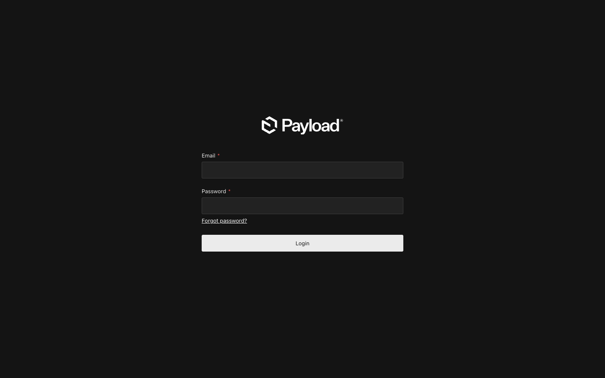

Enter your email and password. First-time super admins are seeded once during setup; new users (any role) are created from Admin → Users → *Create*.

If you forget your password, click **Forgot password?** — Payload emails a reset link to the address on file. (Note: until SMTP is configured, the reset email logs to the container console only. Ask the dev team to read it back.)

Once you're in, you'll land on the dashboard. The left sidebar has two sections:

- **Collections** — list-style content (Posts, Products, Team Members, Users, etc.)
- **Globals** — single-instance content (Home Hero, Site Footer, Page — About, etc.)

> **Tip:** the search box at the top of the sidebar filters both lists. Type "footer" to jump to the Site Footer global; type "team" to jump to Team Members.

---

## 6. Public pages — page-by-page tour

For each page below: **(a)** screenshot of the live page, **(b)** the exact CMS surface(s) that drive it, **(c)** quick "what would I change here" pointers.

---

### 6.1 Home

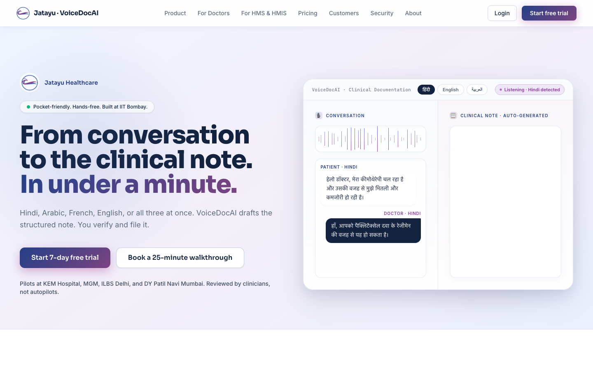

The home page is the biggest one. Every section is editable. Here's the section-by-section map, top to bottom:

| Section on the page                                  | CMS surface                                  |
|------------------------------------------------------|----------------------------------------------|
| Header / nav links                                   | *not editable — wired in code*               |
| Hero badge ("Pocket-friendly. Hands-free. …")       | **Globals → Home Hero → Badge**              |
| Hero headline ("From conversation to the clinical note…") | **Globals → Home Hero → Headline**       |
| Hero subheadline                                     | **Globals → Home Hero → Subheadline**        |
| Hero primary + secondary buttons                     | **Globals → Home Hero → Primary CTA / Secondary CTA** |
| Hero trust line ("Pilots at KEM, MGM, ILBS…")        | **Globals → Home Hero → Trust line**         |
| Hero animated console (right side)                   | *not editable — coded animation*             |
| Ecosystem strip ("Backed by India's innovation…")    | **Globals → Logo Wall** + **Site Meta**     |
| Audience splitter (Doctor / Hospital cards)          | **Globals → Audience Split**                 |
| Metric strip                                         | **Globals → Home Metrics**                   |
| Concise answer block ("VoiceDocAI in plain language")| **Globals → Homepage Concise Answer**        |
| Partner / hospital / EHR logo rows                   | **Globals → Logo Wall**                      |
| How it works                                         | **Globals → How It Works Steps**             |
| Specialties grid (featured 4)                        | **Collections → Specialties** (toggle "Featured on home") |
| Case study spotlight                                 | **Collections → Case Studies** (toggle "Spotlight") |
| Testimonials                                         | **Collections → Testimonials**               |
| Deployment modes grid                                | **Globals → Deployment Modes**               |
| Compliance band                                      | **Globals → Compliance Band**                |
| Founder note (portrait + quote)                      | **Globals → Founder Note**                   |
| Awards / Recognition grid                            | **Collections → Awards**                     |
| FAQ accordion                                        | **Collections → Home FAQs**                  |
| Final purple-gradient CTA                            | *not editable — coded CTA*                   |

> **Tip:** "Save Draft" on any of these surfaces lets you stage a homepage change. Nothing on the live home moves until a super admin clicks Publish.

[Full homepage screenshot](./images/public/home.png)

---

### 6.2 Product — index

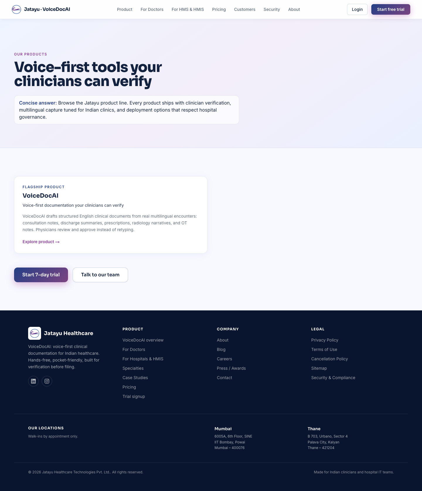

| Section on the page                       | CMS surface                                |
|-------------------------------------------|--------------------------------------------|
| Page header (eyebrow, H1, concise answer) | **Globals → Page — Products (index)**      |
| Intro paragraphs                          | **Globals → Page — Products (index)** → Intro Paragraphs |
| Product cards grid                        | **Collections → Products** — one card per row |
| Bottom CTAs                               | *coded fallback (Start trial / Talk to team)* |

To **add a new product**: open Collections → Products → *Create*. Fill in name, slug, eyebrow, tagline, concise answer. The detail page is published automatically at `/product/<slug>`.

Detail page (`/product/<slug>`) layout: hero (eyebrow + tagline + concise answer) → intro paragraphs → deployment modes grid → patient consent block (optional toggle) → CTAs. Every part is editable from the same Products row.

---

### 6.3 For Doctors

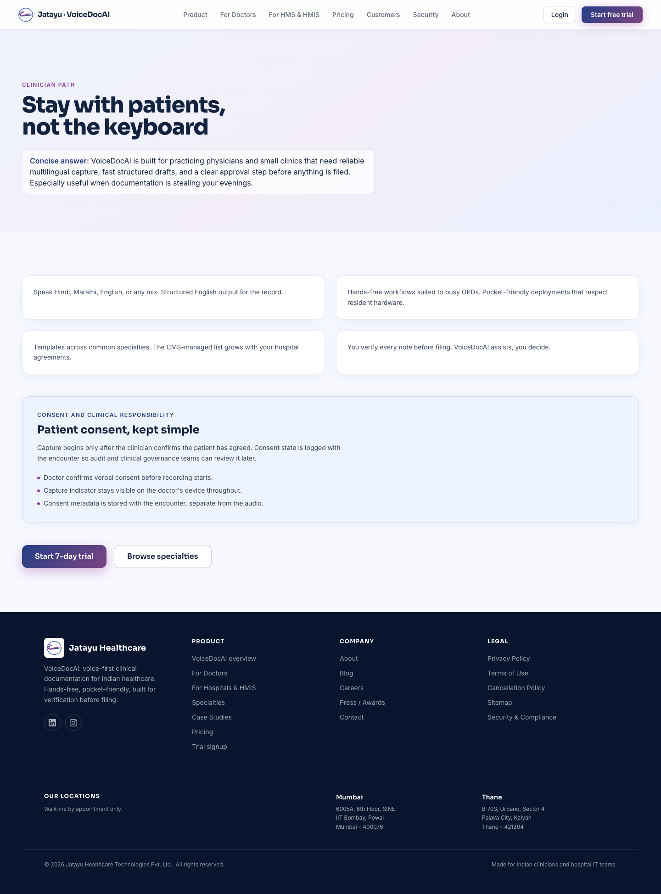

| Section                                  | CMS surface                                    |
|------------------------------------------|------------------------------------------------|
| Header                                   | **Globals → Page — For Doctors**               |
| Benefit cards grid                       | **Globals → Page — For Doctors → Benefits** (array) |
| Patient-consent block (toggleable)       | **Globals → Page — For Doctors → Show patient consent** |
| Bottom CTAs                              | **Globals → Page — For Doctors → Primary / Secondary CTA** |

Common edit: rewording a benefit, adding a 5th benefit card, or swapping the CTA destination.

---

### 6.4 For Hospitals & HMIS

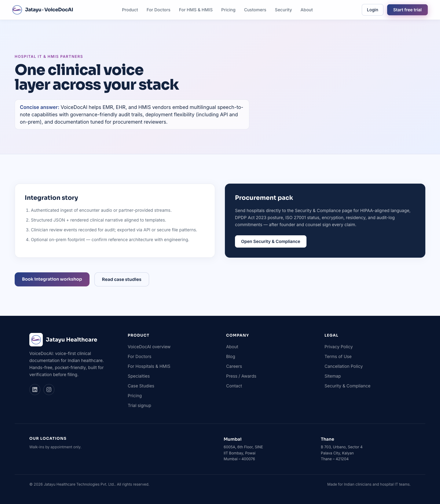

| Section                                                    | CMS surface                                   |
|------------------------------------------------------------|-----------------------------------------------|
| Header                                                     | **Globals → Page — For Hospitals & HMIS**     |
| "Integration story" ordered list (left card)               | …→ Integration Story → Steps (array)          |
| "Procurement pack" dark card (right)                       | …→ Procurement Pack (heading, body, CTA)      |
| Bottom CTAs                                                | …→ Primary / Secondary CTA                    |

The procurement card's CTA defaults to `/security` — change `ctaHref` in the procurement pack group to point somewhere else.

---

### 6.5 About

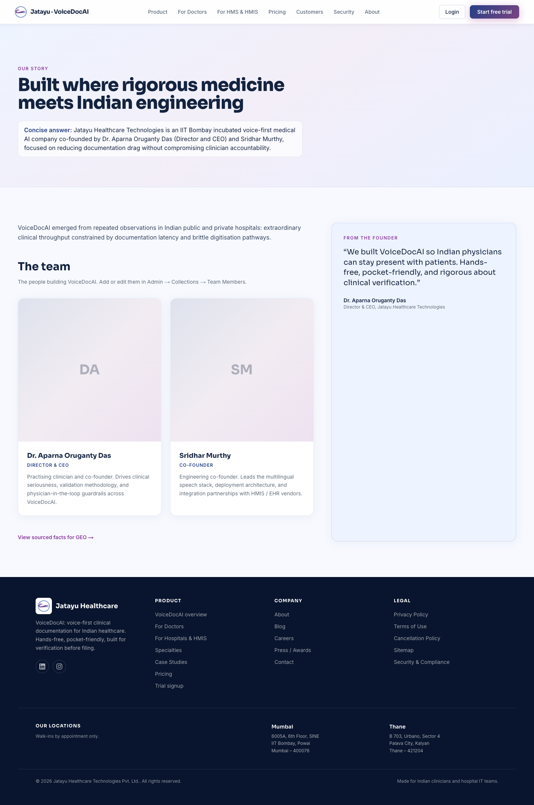

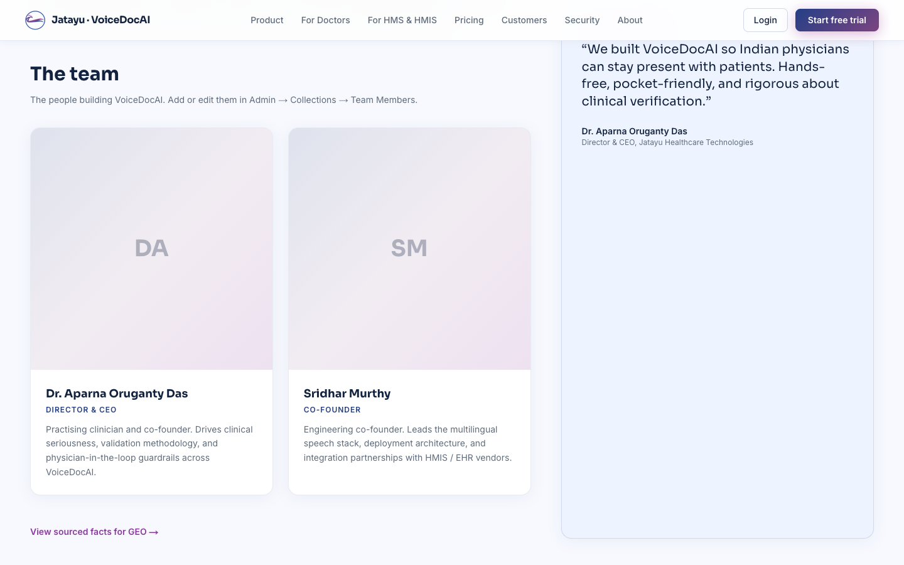

| Section                                            | CMS surface                            |
|----------------------------------------------------|----------------------------------------|
| Header (eyebrow, H1, concise answer)               | **Globals → Page — About**             |
| Intro narrative paragraphs                         | …→ Intro Paragraphs (array)            |
| "The team" heading + subhead                       | …→ Team Section Heading / Subhead      |
| Team grid (photo + name + role + bio cards)        | **Collections → Team Members** — one row per person |
| Founder quote sidebar (sticky)                     | **Globals → Founder Note** (toggleable via Page — About → Show founder quote) |
| "View sourced facts" link                          | *coded link to /about/facts*           |

To add a new team member, see [Common workflows § Add a new team member](#add-a-new-team-member).

---

### 6.6 Contact

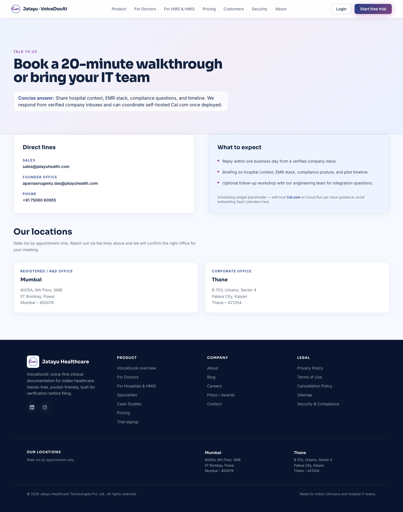

| Section                                     | CMS surface                              |
|---------------------------------------------|------------------------------------------|
| Header                                      | *coded* (planned: AboutPage-style global) |
| "Direct lines" card (sales, founder, phone) | **Globals → Site Meta** — `salesEmail`, `founderEmail`, `phone` |
| "What to expect" card                       | *coded copy*                             |
| "Our locations" card grid                   | **Globals → Site Meta → Offices** (array of {city, lines, label}) |

This is the page that surfaces office addresses. Editing `Globals → Site Meta → Offices` updates both this page **and** the footer of every page.

---

### 6.7 Pricing

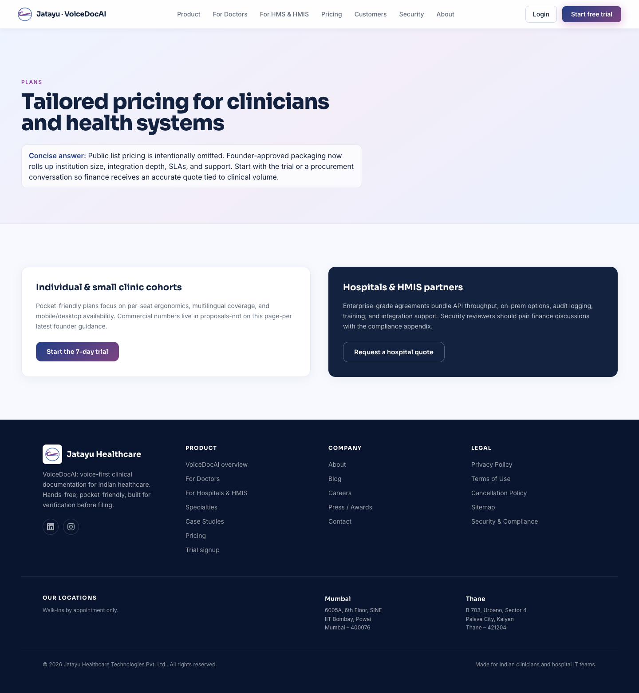

Two cards (Individual & small clinic / Hospitals & HMIS) — both bodies are **currently coded copy**, not in the CMS. If you need to edit pricing language, ask a dev to lift it into a `PricingPage` global (next iteration).

---

### 6.8 Security & Compliance

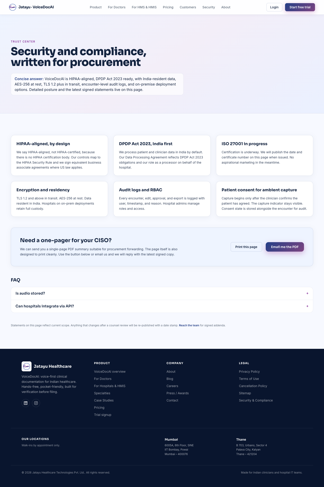

| Section                          | CMS surface                                       |
|----------------------------------|---------------------------------------------------|
| 6 pillar cards                   | *coded* — these are stable claims; edits go through a dev for legal review |
| "Need a one-pager for your CISO" | *coded*                                           |
| FAQ accordion                    | **Collections → Home FAQs** (filtered to security questions in code) |

Every pillar references a legal-grade claim — changing this content requires counsel sign-off, which is why it lives in code rather than the CMS.

---

### 6.9 Case Studies

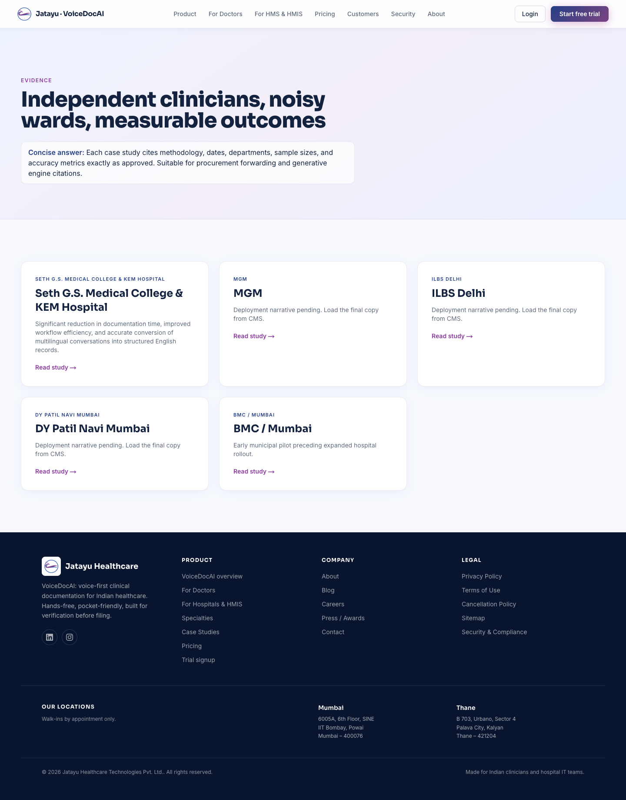

| Section            | CMS surface                                   |
|--------------------|-----------------------------------------------|
| Page header        | *coded* (PageIntro)                           |
| Case study cards   | **Collections → Case Studies** (one row each) |

Add a new study at Collections → Case Studies → *Create*. Each study has its own detail page at `/case-studies/<slug>` rendered from the row's fields (pull-quote, metrics line, cover image, charts).

---

### 6.10 Specialties

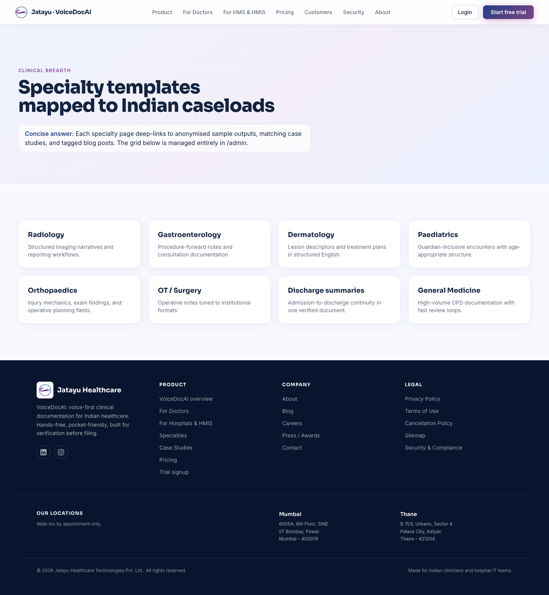

| Section          | CMS surface                                   |
|------------------|-----------------------------------------------|
| Page header      | *coded* (PageIntro)                           |
| Specialty cards  | **Collections → Specialties** (one row each)  |

To highlight a specialty on the homepage, toggle **Featured on home** on the row. Featured rows show up in the home page's 4-card grid (lowest `order` wins).

Detail page (`/specialties/<slug>`) reads the same row's fields.

---

### 6.11 Blog

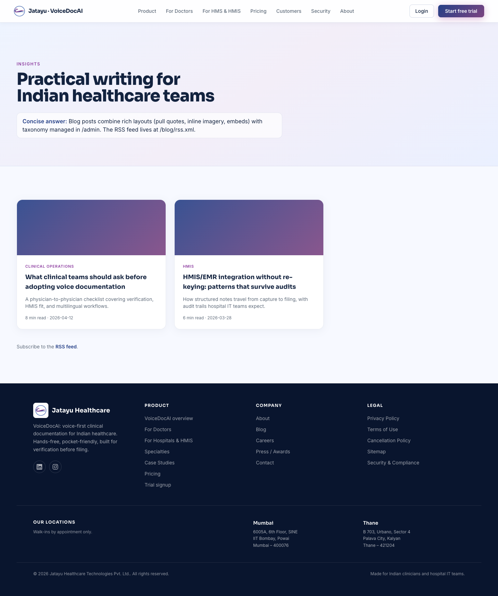

| Section       | CMS surface                                 |
|---------------|---------------------------------------------|
| Page header   | *coded* (PageIntro)                         |
| Post cards    | **Collections → Posts** (one row each)      |
| RSS feed link | *coded* — feed is auto-generated at `/blog/rss.xml` |

Each post has: title, slug, excerpt, category, read-time, published date, hero image, and a rich-text body (Lexical editor — same as Notion-style block editing).

---

### 6.12 Press / Awards

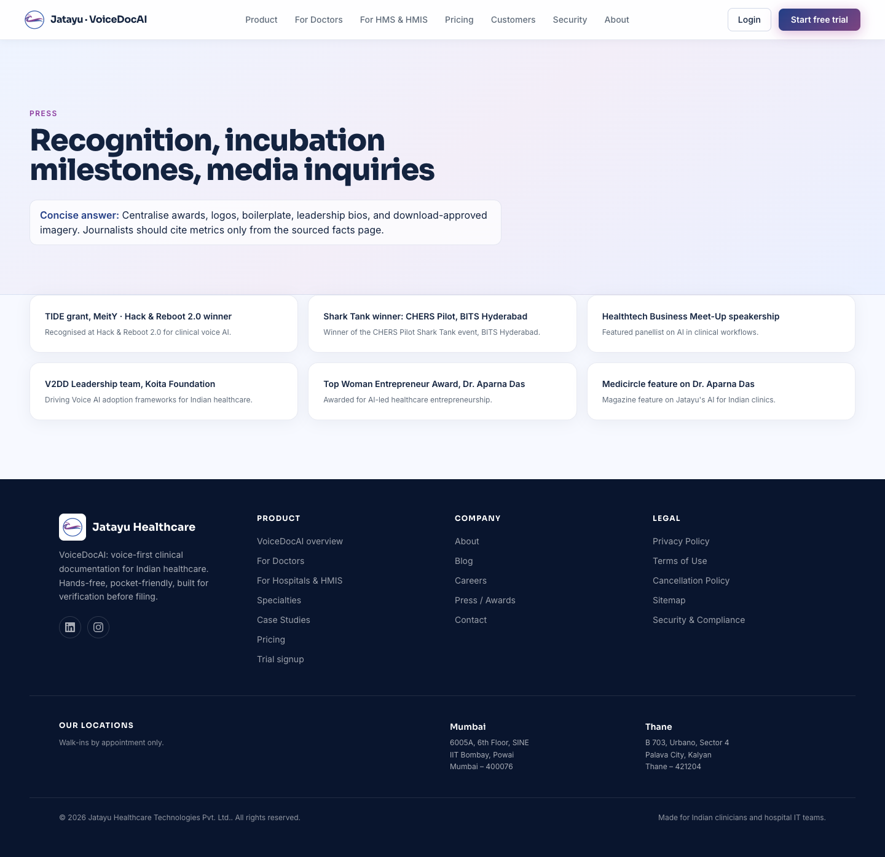

| Section      | CMS surface                              |
|--------------|------------------------------------------|
| Page header  | *coded* (PageIntro)                      |
| Awards grid  | **Collections → Awards** (one row each)  |

Each row has: name, optional detail line, optional image, optional external press link.

---

### 6.13 Careers

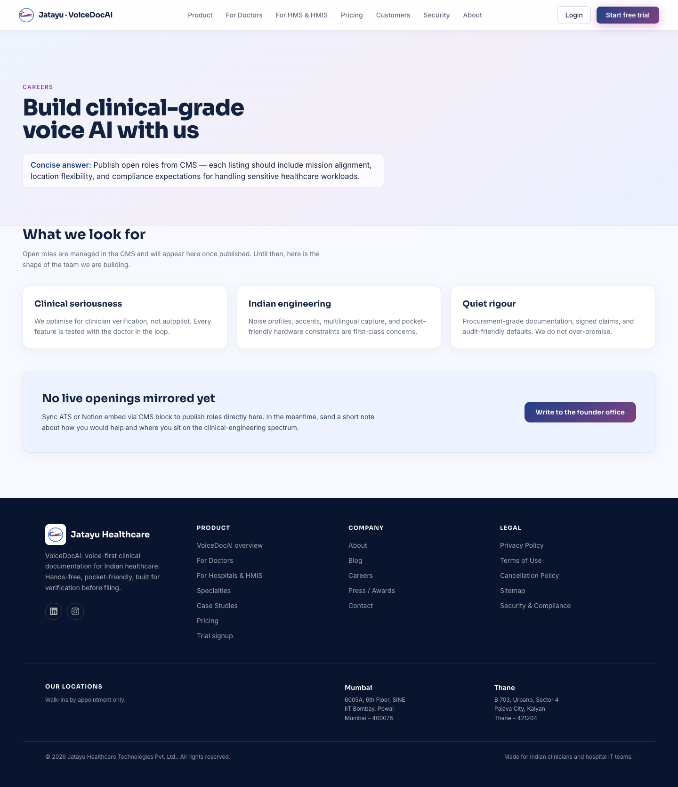

This page is **currently coded** — the "What we look for" card grid is in the page file. When live openings come in, the plan is to add a `Job Openings` collection and surface them above the values grid. For now, ask a dev when you need to publish a role.

---

### 6.14 Trial signup

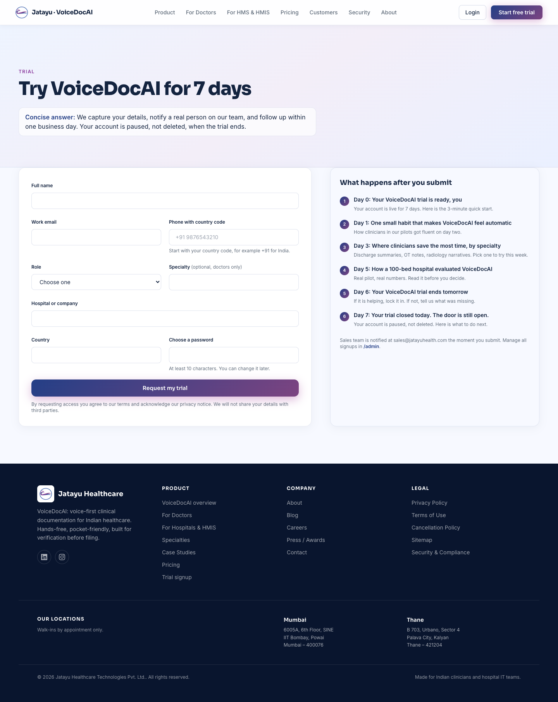

| Section                  | CMS surface                                          |
|--------------------------|------------------------------------------------------|
| Page header              | *coded* (PageIntro)                                  |
| Trial form (left column) | *coded form* — submissions land in **Collections → Leads** |
| "What happens after you submit" sidebar | **Collections → Trial Emails** (drip-email steps) |

To edit the post-signup drip sequence, open Collections → Trial Emails. Each row is one email in the sequence (Day 0, Day 1, Day 3, etc.).

---

### 6.15 Legal pages

| Page              | Source                                                |
|-------------------|-------------------------------------------------------|
| `/privacy`        | *coded* — `src/app/(frontend)/privacy/page.tsx`        |
| `/terms`          | *coded* — `src/app/(frontend)/terms/page.tsx`          |
| `/cancellation`   | *coded* — `src/app/(frontend)/cancellation/page.tsx`   |

Legal copy is intentionally in code (not the CMS) so changes pass through git review and have counsel sign-off. Tell a dev what to update; the change ships in the next deploy.

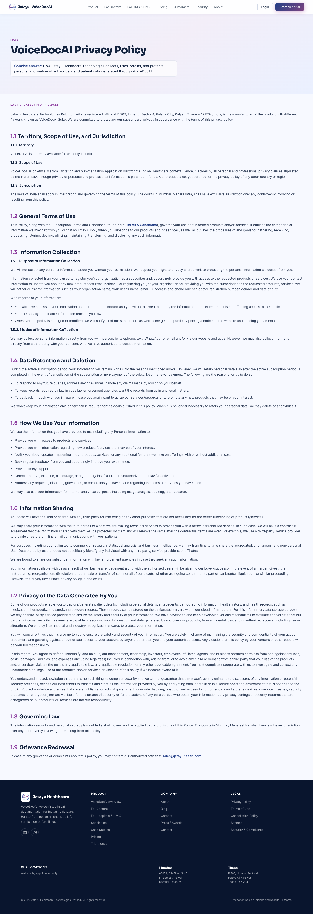

---

### 6.16 Site footer

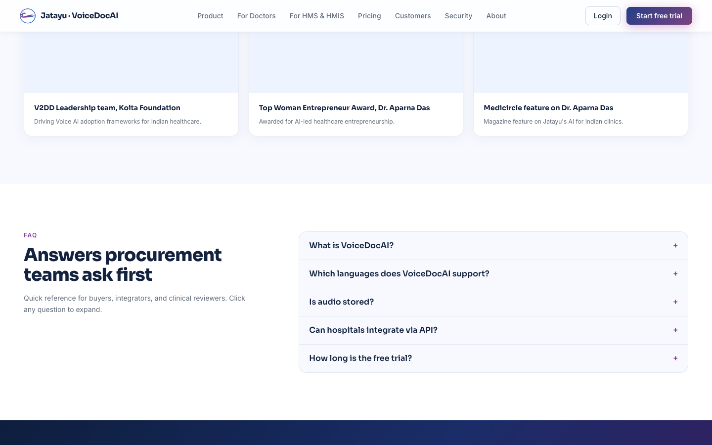

The footer appears on every page. All content is editable via **Globals → Site Footer**:

| Element                                     | Field                                      |
|---------------------------------------------|--------------------------------------------|
| Brand tagline (under the logo)              | `tagline` (textarea)                       |
| Social media icons (LinkedIn, Instagram, …) | `socialLinks` (array — pick platform + URL) |
| Product column                              | `productLinks` (array of {label, href})   |
| Company column                              | `companyLinks` (array of {label, href})   |
| Legal column                                | `legalLinks` (array of {label, href})     |
| "Our locations" strip                       | **Globals → Site Meta → Offices**          |
| © year                                      | *coded* (current year)                     |
| Copyright legal name                        | **Globals → Site Meta → Legal Name**       |
| Right-side strapline                        | `bottomStrapline` (text)                   |

Adding a new social media icon is a one-click thing — see [Add a new social media link](#add-a-new-social-media-link).

---

## 7. The CMS — every collection and global

### 7.1 Globals — page chrome

Globals are **single-instance** content. There's only one Home Hero, one Site Footer, etc. Every global has Save Draft + Publish.

| Global                       | Drives                                          |
|------------------------------|-------------------------------------------------|
| **Site Meta**                | Logo, legal name, sales/founder/support emails, phone, default page title + description, office addresses, header logo |
| **Home Hero**                | Hero badge, headline, subheadline, trust line, both CTAs on `/` |
| **Home Metrics**             | The 5-up metric strip on `/`                   |
| **Audience Split**           | Doctor / Hospital cards on `/`                 |
| **Homepage Concise Answer**  | The 40–60 word AEO answer block on `/`         |
| **How It Works Steps**       | The 5-step flow on `/` + flow diagram image    |
| **Logo Wall**                | Partner / hospital / EHR / supporter logo strips on `/` |
| **Patient Consent**          | The "Patient consent, kept simple" block used on `/product`, `/for-doctors`, etc. |
| **Compliance Band**          | "Compliance and trust" card row on `/`         |
| **Deployment Modes**         | "Modes of deployment" grid on `/` and `/product/<slug>` (if no per-product override) |
| **Founder Note**             | Founder portrait, name, role, quote — used on `/` and the `/about` sidebar |
| **Page — Products (index)**  | Header copy + SEO for `/product`               |
| **Page — For Doctors**       | Everything on `/for-doctors`                   |
| **Page — For Hospitals & HMIS** | Everything on `/for-hospitals-and-hmis`    |
| **Page — About**             | Header, intro, team-section copy, founder-quote toggle, SEO for `/about` |
| **Site Footer**              | Footer tagline, link columns, social icons, bottom strapline |

### 7.2 Collections — list-style content

Collections are **lists** of items, where each item is one row.

| Collection         | One row = …                                                | Surfaces on                                  |
|--------------------|------------------------------------------------------------|----------------------------------------------|
| **Products**       | One product (name, slug, tagline, intro paragraphs, deployment modes, CTAs, SEO) | `/product` index card + `/product/<slug>` detail page |
| **Team Members**   | One person (name, role, description, photo)               | `/about` team grid                            |
| **Posts**          | One blog post (rich-text body, hero image, category, etc.) | `/blog` listing + `/blog/<slug>`             |
| **Specialties**    | One specialty (title, slug, blurb, optional icon)         | `/specialties` grid + `/specialties/<slug>` + featured on `/` |
| **Case Studies**   | One pilot/deployment (institution, pull quote, metrics, cover image, charts) | `/case-studies` grid + `/case-studies/<slug>` + spotlight on `/` |
| **Testimonials**   | One quote (quote, attribution, role, consent toggle)      | Home page testimonial cards                  |
| **Awards**         | One award (name, detail, image, source URL)               | `/press` grid + home page Awards rail        |
| **Home FAQs**      | One Q&A pair                                              | Home FAQ accordion + filtered subsets on other pages |

Each row has its own Save Draft / Publish controls and shows status in the list view.

### 7.3 System collections

These exist for plumbing — touch only when you know why.

| Collection      | Purpose                                                  |
|-----------------|----------------------------------------------------------|
| **Users**       | Login accounts for `/admin`. Only super admins should create/modify rows here. |
| **Media**       | All image uploads. Files are stored on Azure Blob in production. Upload here once, then reference from many places (founder portrait, team photos, case-study cover images, etc.). |
| **Leads**       | Trial-signup form submissions. Read-only in practice; the form writes here. |
| **Trial Emails**| The drip-email sequence shown on `/trial`'s "What happens after you submit" panel. Edit to retitle each step. |

---

## 8. Common workflows

### Add a new team member

1. Log in to `/admin`.
2. Sidebar → **Collections → Team Members → Create new**.
3. Fill in:
    - **Name** — full name (e.g. "Priya Iyer")
    - **Role** — designation (e.g. "Head of Clinical Validation")
    - **Description** — 30–60 word bio
    - **Photo** — click upload, choose a square portrait, save
    - **Order** — lower number = appears earlier (defaults to 100; existing members are at 10, 20, etc.)
4. Click **Save Draft** to stash the change, or **Publish** (super admin) to push live.
5. Open `/about` in another tab and refresh — the new card appears in the grid.

If you don't see a photo, the card falls back to a soft gradient with the person's initials.

### Add a new product

1. Sidebar → **Collections → Products → Create new**.
2. Fill in: name, slug (URL-safe, e.g. `voicedocai-pro`), eyebrow, tagline, concise answer.
3. Add intro paragraphs (each row = one `<p>`).
4. Add deployment modes (each row = one card: title + body).
5. Toggle "Show patient consent" if you want that block on the detail page.
6. Set primary + secondary CTA labels and URLs.
7. Set order (lower = first on the `/product` listing) and SEO title/description.
8. **Save Draft**, review at `/product/<slug>`, then **Publish**.

### Add a new case study

1. Sidebar → **Collections → Case Studies → Create new**.
2. Fill in: institution, slug, pull quote, metrics line, link label.
3. (Optional) Toggle **Spotlight** to feature on the home page (only one spotlight at a time).
4. Upload cover image and any pilot charts (time saved, specialty distribution, etc.) — these surface on the detail page.
5. Set published date and order.
6. Save Draft → review at `/case-studies/<slug>` → Publish.

### Add a new blog post

1. Sidebar → **Collections → Posts → Create new**.
2. Title, slug, excerpt, category (e.g. "Clinical practice"), read-time minutes.
3. Set published date (this also controls sort order on `/blog`).
4. Write the body in the rich-text editor (paragraphs, headings, lists, links, images).
5. Upload hero image.
6. Save Draft, preview at `/blog/<slug>`, Publish.

### Add a new social media link to the footer

1. Sidebar → **Globals → Site Footer**.
2. Scroll to **Social links** → click **Add Social link**.
3. Pick the platform from the dropdown (LinkedIn / Instagram / X (Twitter) / YouTube / Facebook).
4. Paste the full URL (include `https://`).
5. Save Draft → Publish.

The icon is mapped automatically from the platform name — you never paste raw SVG.

If you need a platform that isn't in the dropdown (e.g. TikTok), that's a one-line code change — ask a dev.

### Change a homepage CTA button

The headline CTAs ("Start 7-day free trial" / "Book a 25-minute walkthrough") live in **Globals → Home Hero → Primary CTA / Secondary CTA**. Each has a label and an href. Save Draft → Publish.

### Unpublish something

In any list view (e.g. **Collections → Blog Posts**):

1. Open the row.
2. In the top-right status dropdown, switch from **Published** → **Draft**.
3. Click Save.

The public site re-renders without that row on the next request. Re-publishing reverses it (super admin).

To **delete** outright, use the trash icon in the list view. Deletes go through the same cache-invalidation hook so the public site updates instantly.

---

## 9. When you need a developer

Reach out to engineering for any of these:

- **A new field on something that already exists** ("add a Twitter handle to Team Members"). Requires the field added in code + a `npm run sync-prod-schema` + a deploy.
- **A brand-new collection or global** ("add a Pricing Tiers section"). Same as above.
- **Layout / styling changes** ("make the team grid 3 columns instead of 2 on desktop"). Pure code.
- **Page reshuffling** ("put case studies above testimonials on the home page"). Code change.
- **New social media platforms in the dropdown.** One-line code change + new SVG icon.
- **Edits to coded copy** (legal pages, security pillars, pricing card descriptions, careers values cards). These are intentionally in code so they pass git review.
- **New user roles** beyond `super_admin` / `editor`.

When asking for a CMS-able field, include:
1. The page section you're trying to control
2. The shape of the data (one value? a list? structured rows?)
3. Whether editors should be able to publish, or only super admins

---

## 10. Quick reference

### Public URL → CMS surface

| Public URL                          | Primary CMS surface                            |
|-------------------------------------|------------------------------------------------|
| `/`                                 | **Globals → Home Hero** (+ many others — see [§6.1](#61-home)) |
| `/product`                          | **Globals → Page — Products (index)** + **Collections → Products** |
| `/product/<slug>`                   | **Collections → Products** (one row)           |
| `/for-doctors`                      | **Globals → Page — For Doctors**              |
| `/for-hospitals-and-hmis`           | **Globals → Page — For Hospitals & HMIS**     |
| `/about`                            | **Globals → Page — About** + **Collections → Team Members** |
| `/about/facts`                      | *coded — sourced from Home Metrics global*    |
| `/contact`                          | **Globals → Site Meta** (emails, phone, offices) |
| `/pricing`                          | *coded*                                       |
| `/security`                         | *coded* + **Collections → Home FAQs**         |
| `/case-studies`                     | **Collections → Case Studies**                |
| `/case-studies/<slug>`              | **Collections → Case Studies** (one row)      |
| `/specialties`                      | **Collections → Specialties**                 |
| `/specialties/<slug>`               | **Collections → Specialties** (one row)       |
| `/blog`                             | **Collections → Posts**                       |
| `/blog/<slug>`                      | **Collections → Posts** (one row)             |
| `/press`                            | **Collections → Awards**                      |
| `/careers`                          | *coded*                                       |
| `/trial`                            | **Collections → Trial Emails** (sidebar)      |
| `/privacy` / `/terms` / `/cancellation` | *coded*                                  |
| Footer (every page)                 | **Globals → Site Footer** + **Globals → Site Meta** |

### Save Draft vs Publish at a glance

```
┌──────────────────────────────────────────────────────────────────────┐
│  /admin                                                              │
│                                                                      │
│  EDITOR clicks Save Draft         →  draft stored, public unchanged  │
│  EDITOR clicks Publish            →  ❌ error: "Only a super admin   │
│                                       can publish changes."          │
│                                                                      │
│  SUPER ADMIN clicks Save Draft    →  draft stored, public unchanged  │
│  SUPER ADMIN clicks Publish       →  promoted to live, public        │
│                                       cache invalidated, next        │
│                                       request shows new content      │
└──────────────────────────────────────────────────────────────────────┘
```

---

## Adding /admin screenshots to this guidebook

The screenshots in this guidebook show the live public site. For inside-the-CMS screenshots (collection list views, edit forms, the save/publish buttons), take a screenshot while you're logged in to `/admin` and drop the file into `docs/images/admin/` — then add an `` line at the spot where it would help.

Suggested screenshots to add:

| File name                | What to capture                                            |
|--------------------------|------------------------------------------------------------|
| `dashboard.png`          | The /admin dashboard with the left sidebar visible        |
| `team-members-list.png`  | The Team Members collection list view                     |
| `team-member-edit.png`   | A single Team Member's edit form (showing photo upload)   |
| `home-hero-edit.png`     | The Home Hero global edit form                            |
| `save-publish-buttons.png` | Close-up of the Save Draft + Publish buttons (top-right of any edit screen) |
| `version-history.png`    | The version history panel (sidebar on any edit screen)    |

---

*Last updated: see `git log -1 -- docs/cms-guidebook.md`*
